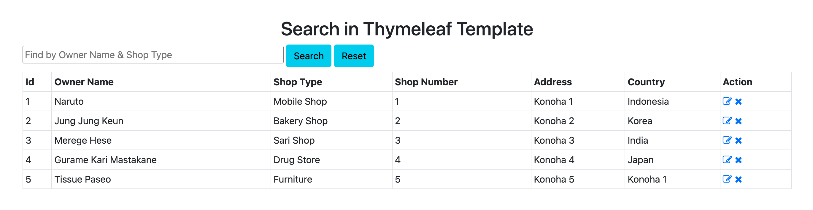
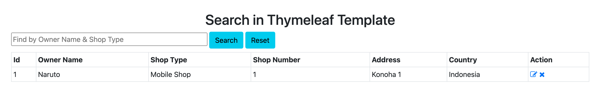

# Spring-Boot-Search-Example-using-Thymeleaf-and-Spring-Data-JPA

### Things  todo list

1. Clone this
   repository: `git clone https://github.com/hendisantika/Spring-Boot-Search-Example-using-Thymeleaf-and-Spring-Data-JPA.git`
2. Navigate to the folder: `cd Spring-Boot-Search-Example-using-Thymeleaf-and-Spring-Data-JPA`
3. Change Db credentials in `application.properties` file
4. Run the application: `mvn clean spring-boot:run`
5. Open your favorite browser: http://localhost:8080

### Image screen shot

Home Page

Search Page

